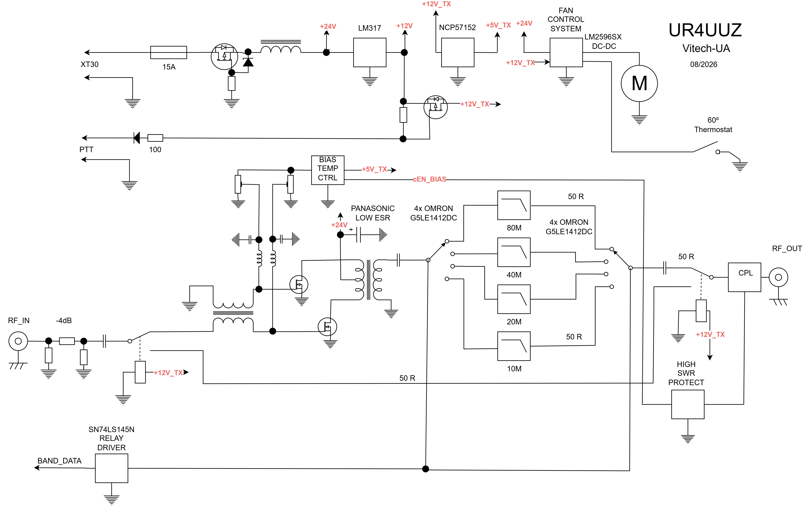
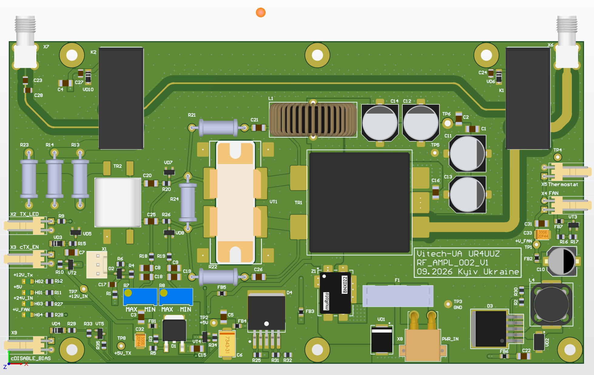
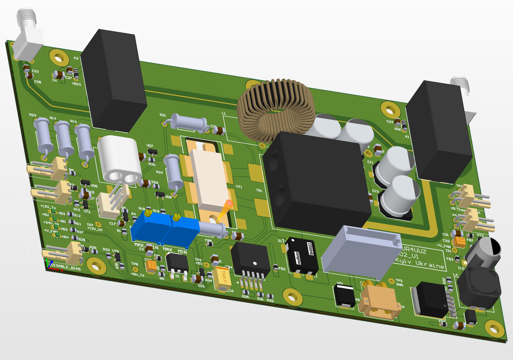
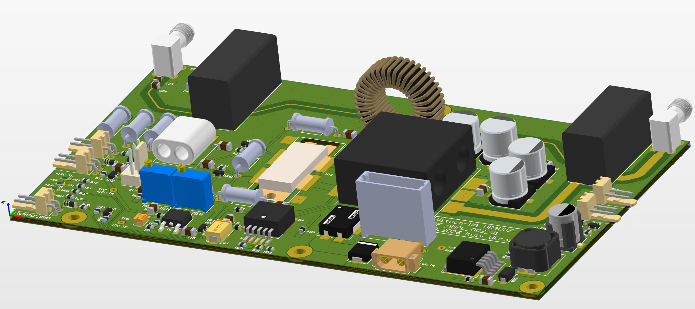
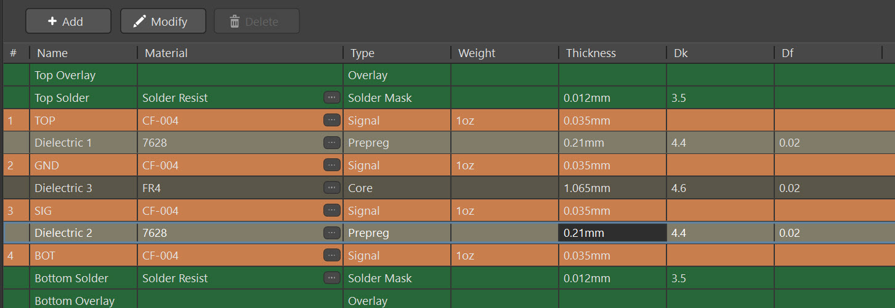
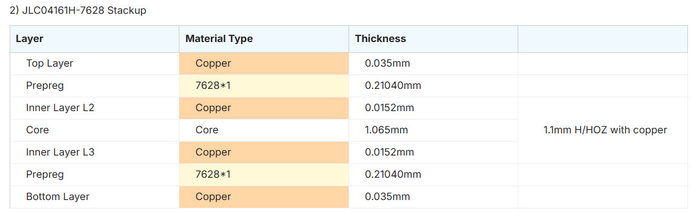
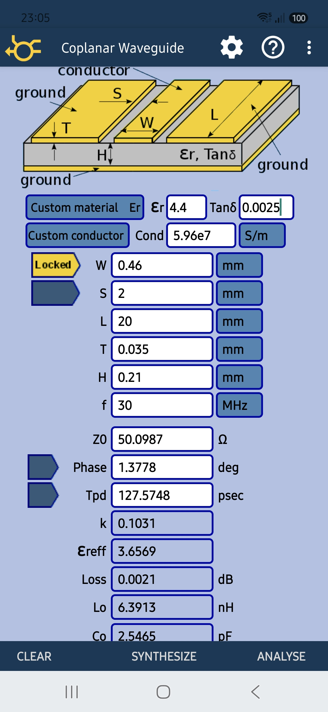

# RF_AMPLIFIER_3..30MHz_MRF186
Проєкт підсилювача КХ на LDMOS збірці MRF186
https://www.nxp.com/docs/en/data-sheet/MRF186.pdf

# Функційна схема

# Зовнішній вигляд TOP

# Стек шарів

# Стек-профіль JLCPCB

# Розрахунок CPW

